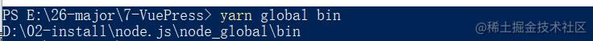
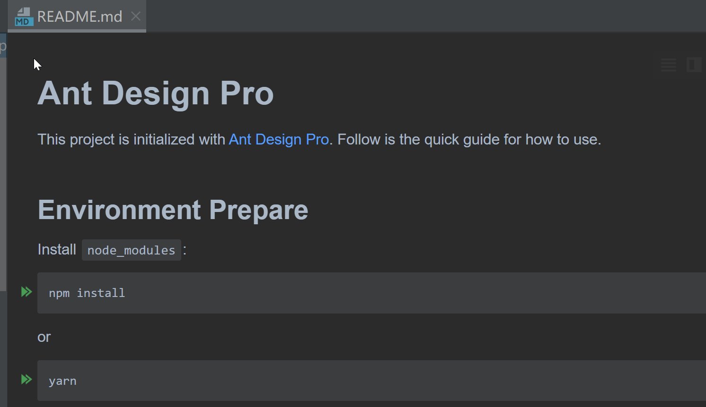
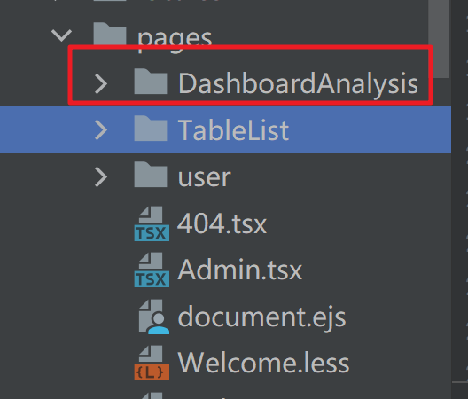
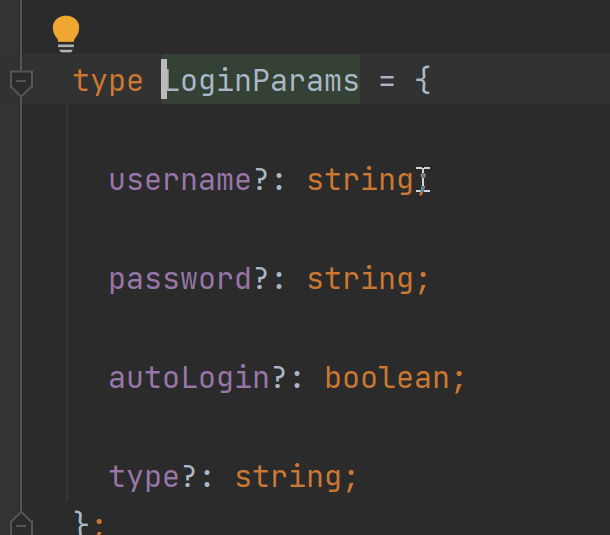
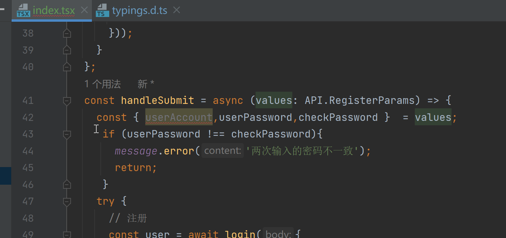
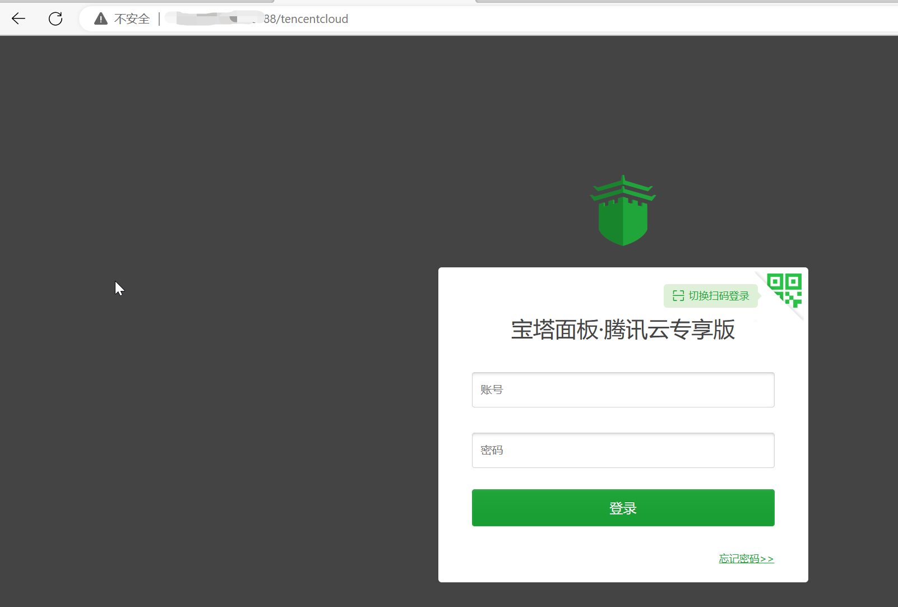
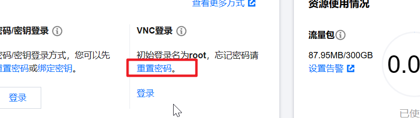
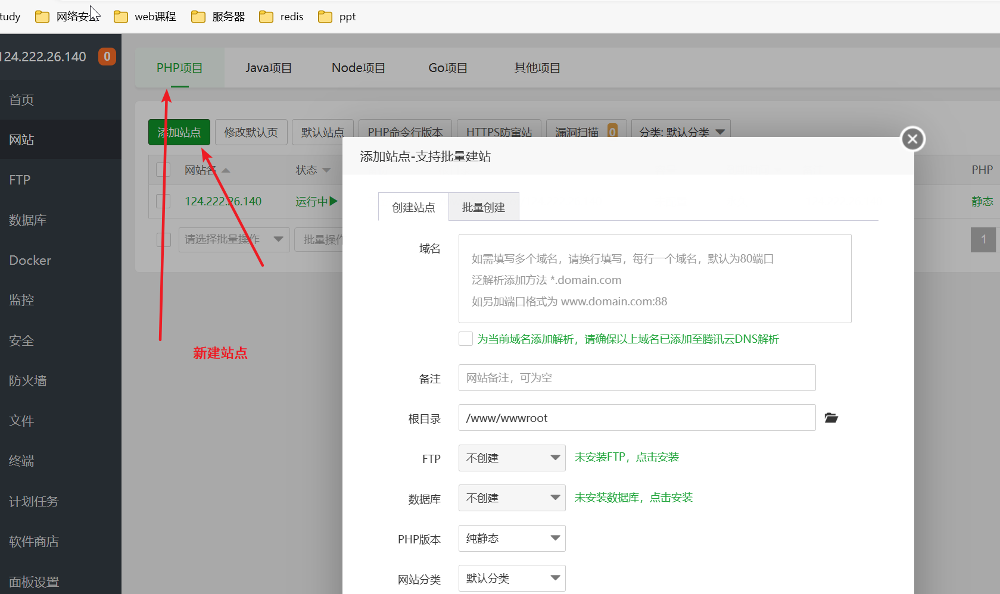

# 1.0 企业做项目流程

* 需求分析

* 设计（概要设计，详细设计）

* 技术选型

* 搭建项目，初始化项目/引入需要的技术框架

* 写demo，有用于测试

* 写代码，实现业务逻辑

* 测试，进行单元测试

*  代码提交到远程仓库，代码评审

* 部署（放到服务器或者容器），灰度发布

  

# 2.0 需求分析

功能：

* 登录/注册

* 用户管理（仅管理员可见），对用户的查询以及修改

* 用户校验（限制某些人注册）

  

# 2.1技术选型

前端： 三件套 + React + 组件库 Ant Design + 开发框架Umi + Ant Design Pro(现成的管理系统)

后端： java + ssm + mybatis + mybatisPlus + springboot + mysql

部署： 服务器/容器（平台）

# 2.2初始化项目

## 2.2.1 前端初始化：

* 引入组件

> 下载node.js;
>
> 进入Ant DesignPro的官网

注：yarn 是一个包管理器，用于直接将一些组件通过命令行的方式引入项目当中，下图是下载yarn，它支持并发，可以理解为比npm快。


* 找到一个合适的文件夹，cmd快速初始化脚手架（参考Ant design pro官网），运行yarn create umi myapp；

> 使用yarn时，报错说“文件名、目录名或卷标语法不正确。                                     error Command failed.  ”  
>
> 解决方案：
>
> 首先查看 yarn bin 目录的位置：
>
> ```
> yarn global bin
> ```
>
> 
>
> 再查看 yarn 的全局安装位置：
>
> ```
> yarn global dir
> ```
>
> 
>
> 结果发现，yarn 的全局安装位置与 bin 目录的位置并不一致，于是去修改 yarn 的全局安装位置和缓存位置：
>
> ```cmd
> // 改变yarn全局安装的位置 
> yarn config set global-folder "要安装yarn的磁盘路径"
> // 例子
> yarn config set global-folder "D:\02-install\yarn\global"
> 
> // 改变yarn缓存位置
> yarn config cache-folder "要存放yarn缓存的磁盘路径"
> // 例子
> yarn config set cache-folder "D:\02-install\yarn\cache"
> 复制代码
> ```
>
> 我这里的 yarn 是不放在 node 的文件夹里面的，当然这个不是重点，重点是要将**yarn bin目录和安装的模块放在相同的硬盘分区里面**。
>
> 再次运行yarn create umi myapp ，终于成功运行：

* * 第一次初始化一个现成的管理系统，选择一个大的。

    

    生成页面如下：

    

    

* 用前端开发工具WebStorm打开项目，安装依赖，否则您会看到一大片红海：除了自动提示安装依赖，还可以在终端窗口使用命令；

* 

  

  跑一下项目：

  

  * 打开之后大概是这个鬼样子

    

    

  #### 项目瘦身

  删除一些不必要的文件，删除之后在route路由里面也删一下，若是因为删除了某些文件，但现存的文件里面引用到了这些删除的文件，可以也把这个现存文件也删了。

  * 移出国际化，在package.json以及locals进行操作
  * 删除测试 e2e
  * 删除生成后的页面，记得删路由

  

  * 删除service里面的swagger接口文档工具，
  * 删除config的oneapi 定义的一些接口

  

  * 删除test 


于是报错：


全局搜索哪里用到了，删了就行，就是下面这一大块


项目正常启动。


## 2.2.2后端初始化：

* 准备环境

* 引入框架
  * 进入start.spring.io 将springboot框架拉下来，可以带入一些自动的依赖。

## 2.2.3数据库环境准备以及数据库的设计：

### 数据库环境准备：

可以用navicat，也可以idea直接连接。

> ### MySQL
>
> 在MySQL中，`CREATE SCHEMA`(创建一个模式)表示创建了一个数据库，这是因为`CREATE SCHEMA`是`CREATE DATABASE`的同义词。 换句话说，你可以使用`CREATE SCHEMA`或者`CREATE DATABASE`来创建一个数据库。
>
> ### Oracle Database
>
> 在Oracle中，`CREATE SCHEMA`语句实际上并不创建一个模式，这是因为已经为在创建用户时，数据库用户就已经创建了一个模式，也就是说在ORACLE中`CREATE USER`就创建了一个schema，`CREATE SCHEMA`语句允许你将schema同表和视图关联起来，并在这些对象上授权，从而不必在多个事务中发出多个SQL语句。
>
> ### SQL Server
>
> 在SQL Server中，`CREATE SCHEMA`将按照名称创建一个模式，与MySQL不同，`CREATE SCHEMA`语句创建了一个单独定义到数据库的模式。和ORACLE也不同，`CREATE SCHEMA`语句实际创建了一个模式(前面说到这个语句在ORACLE中不创建一个模式)，在SQL Server中，一旦创建了模式，就可以往模式中添加用户和对象。


去mvn仓库引入mybaits 以及 mybatisPlus的依赖；


把属性配置文件改成yaml的；

* 参考mybatisPlus的官网将其环境搭建好，包括一些配置和注解；

* 测试msp

  

  注： 


### 数据库设计

有哪些表（模型）？有哪些字段？字段的类型？数据库字段添加索引？表与表之间的关联？

> `Mybatis-plus`中默认开启驼峰式下划线转换映射。即库中 `top_id` 查到数据后—》会映射到实体类中 `topId` 该属性上。
> 可以手动关闭：[mybatis-plus](https://so.csdn.net/so/search?q=mybatis-plus&spm=1001.2101.3001.7020).configuration.map-underscore-to-camel-case=false

可以使用E-R图之类的；

字段（思考名称和类型）如下，可以使用下划线，将来转化为驼峰对应实体类中的属性；


> IDEA 配置连接数据库报错 Server returns invalid timezone. Need to set ‘serverTimezone’ property.
>
>
> 原因是MySQL驱动中默认时区是UTC，与本地时间（中国）相差八个小时，所以链接不上。
> 可以用两种方法解决，都是解决时区问题。
>
> 1、点开最右侧 Advanced，找到 serverTimezone，在右侧value处填写 GMT，保存即可！(或填写 Asia/Shanghai)
>
> 
>
>
> 2、也可以在url后添加：?serverTimezone=GMT
>
> 3、版本问题:MySQL驱动 8.0.x新版本的需要设置时区，5.1.x 版本的不需要设置时区，可以直接选择5.1.x的版本省掉时区设置（根据需要选择）
>
> 

创建完之后：


# 2.3 实现业务逻辑 后端：

> 写代码 

## 2.3.1 注册： 

* 规整项目目录，创建controller，service，mapper，utils；删除rescources下的static以及templates文件夹，之前做前后端不分离的时候一直用到这两个文件，现在做的是前后端分离的；
* 实现模型到对象的映射，这里使用插件自动生成；


插件的使用：


​我去！第一次用，简直震惊了我的瞳孔，太方便了吧，以前写的都是什么玩意儿.... :sob: 


然后再重构一下目录；

* 测试

  

  

> 针对有些插件搜索不到的解决办法：
>
> ## 解决方法
>
> #### 1、打开setting
>
> 

重启即可生效。

安装两个插件：

1. SonarLint

   


2. GenerateAllSetter


>  快捷键：ctrl + p 来查看某方法能够传入的参数；

结果报错：

 解决：

mybatisPlus自动将下划线转成驼峰，将其功能在配置文件当中关闭即可。

查看官方文档：


### 逻辑

* 编写注册逻辑：校验密码就是二次输入密码，用于确认

  

  * 编写对应的注册service以及实现类：

    * 这里使用到了一个依赖Apache Commons Lang，

    


利用刚才依赖里面的方法直接判断这些参数是否为空，是否为null；

* 根据编写的注册逻辑，一步步在service里面直接写代码：

> 新知识： **正则表达式 **  
>
> ### 一、正则表达式
>
> 规则表达式（regular expression）
>
> 1. 是一个对象，叫正则对象
> 2. 是一个强大的字符串匹配和处理工具（除了处理字符串，其他的什么都做不了）
> 3. 它是火星文，一般人很难理解（程序界的摩斯码）
> 4. 它还是一种思维方式
> 5. 容易学，但是也非常容易忘记
>
> ### 二、使用场景
>
> 1. 字符串匹配和替换
> 2. 表单验证
>
> > 1、比如网站要求你输入的QQ号为5~12位数字
> > 2、电话号码必须是010-12345678或0731-88032131这样的字符串
> > 3、比如Email邮箱验证
> > 4、比如过滤关键字或者过滤HTML标签
> > 5、比如发表评论的时候只允许中文评论
> > 6、比如去除字符串首尾空格
> > ---正则是不是必须--- 正则虽然不是必须的，但是用了正则后，会让你的代码更少，效率更高，可读写更好

在这里校验账户当中不能包含特殊字符就用到了这个东西：

```java
 //判断账户是否包含特殊字符，使用正则表达式
        String validPatern = "[`~!@#$%^&*()+=|{}':;',\\\\[\\\\].<>/?~！@#￥%……&*（）——+|{}【】‘；：”“’。，、？]";
        Matcher matcher = Pattern.compile(validPatern).matcher(userAccount);
        if (matcher.find()) {
            return -1L; //如果包含特殊字符，则返回-1
        }
```


* 将新注册用户保存到数据库
* 根据写的需求在测试里面依次进行断言测试，最终测试通过。


## 2.3.2 登录：

* 实现逻辑

接收参数： 用户账户，密码

请求类型： POST 

> 请求参数很长时，不建议使用get

请求体：json格式的数据

返回值：用户信息（脱敏）

### 逻辑

1. 校验用户账户和密码是否合法	
   1.  非空
   2. 账户长度不小于4位
   3. 密码不小于8位
   4. 账户不包含特殊字符

> 为什么还要判断账户呢？因为这些是最基本的条件，如果这些都不能满足的话，就没有必要再去数据库当中查询，节省资源，不造成性能浪费。

2. 校验密码是否输入正确，要和数据库中的密文密码去做对比
3. 记录用户的登录态（session），将其存到服务器当中，用后端springboot框架自带的服务器tomcat去记录，当浏览器端携带cookie来请求时，判断是否为统一用户
4. 返回用户信息（**脱敏**）

> 快捷键：三击鼠标可以快速选中一行
>
> 快捷键：Alt + Ctrl + L 可以快速格式化
>
> 

>  prsf可以快速打出一个常量：private static final


* 按照上面的逻辑，编写service代码;

> 这里存在一些问题：逻辑删除之后的用户，还能包含在查找范围内嘛？这是肯定不行的，myp帮我们提供了逻辑删除，参考官方文档：
>
> 

### 用户注销

* 对应的service 以及controller ，主要是移出session


## 控制层Controller

> @RestController相当于@Controller 和 @ResponseBody的注解合成，适用于编写restful风格的api，返回值默认为json类型。 


>  插件： auto filling java call arguments ，自动补充参数


### @RequestBody回顾：

> 
>
> ### 
>
> 功能介绍
> @RequestBody主要用来接收前端传递给后端的json字符串中的数据的(请求体中的数据的)，并且封装到对象当中；
>
> GET方式无请求体，所以使用@RequestBody接收数据时，前端不能使用GET方式提交数据，而是用POST方式进行提交。
>
> 在后端的同一个接收方法里，@RequestBody与@RequestParam()可以同时使用，@RequestBody最多只能有一个，而@RequestParam()可以有多个。
>
> JSON字符串转换对象的逻辑
> 后端@RequestBody注解对应的类在将HTTP的输入流(含请求体)装配到目标类(即：@RequestBody后面的类)时，会根据json字符串中的key来匹配对应实体类的属性，如果匹配一致且json中的该key对应的值符合(或可转换为)
>
> 1. json字符串中，如果value为"“的话，后端对应属性如果是String类型的，那么接受到的就是”"，如果是后端属性的类型是Integer、Double等类型，那么接收到的就是null。
> 2. json字符串中，如果value为null的话，后端对应收到的就是null。
> 3. 如果某个参数没有value的话，在传json字符串给后端时，要么干脆就不把该字段写到json字符串中；要么写value时， 必须有值，null 或"“都行。千万不能有类似"stature”


* 这里需要一个能够封装对象的请求类，专门建立这样一个类。
* 这里将对象进行序列化，又触碰到了一个知识盲区：

### 序列化

>  Java 提供了一种对象序列化的机制，该机制中，一个对象可以被表示为一个字节序列，该字节序列包括该对象的数据、有关对象的类型的信息和存储在对象中数据的类型。

>    将序列化对象写入文件之后，可以从文件中读取出来，并且对它进行反序列化，也就是说，对象的类型信息、对象的数据，还有对象中的数据类型可以用来在内存中新建对象。

>  整个过程都是 Java 虚拟机（JVM）独立的，也就是说，在一个平台上序列化的对象可以在另一个完全不同的平台上反序列化该对象。

>  类 ObjectInputStream 和 ObjectOutputStream 是高层次的数据流，它们包含反序列化和序列化对象的方法。

>  ObjectOutputStream 类包含很多写方法来写各种数据类型，但是一个特别的方法例外：

>  public final void writeObject(Object x) throws IOException

>  上面的方法序列化一个对象，并将它发送到输出流。相似的 ObjectInputStream 类包含如下反序列化一个对象的方法：

> public final Object readObject() throws IOException,                                   ClassNotFoundException

>  该方法从流中取出下一个对象，并将对象反序列化。它的返回值为Object，因此，你需要将它转换成合适的数据类型。

>  为了演示序列化在Java中是怎样工作的，我将使用之前教程中提到的Employee类，假设我们定义了如下的Employee类，该类实现了Serializable 接口。

```java
public class Employee implements java.io.Serializable {    public String name;    
public String address;  
public transient int SSN;  
public int number;  
public void mailCheck()    {       System.out.println("Mailing a check to " + name                            + " " + address);    } }
```

> 请注意，一个类的对象要想序列化成功，必须满足两个条件：
>
> 该类必须实现 java.io.Serializable 接口。
>
> 该类的所有属性必须是可序列化的。如果有一个属性不是可序列化的，则该属性必须注明是短暂的。
>
> 如果你想知道一个 Java 标准类是否是可序列化的，请查看该类的文档。检验一个类的实例是否能序列化十分简单， 只需要查看该类有没有实现 java.io.Serializable接口。
>
> ObjectOutputStream 类用来序列化一个对象，如下的 SerializeDemo 例子实例化了一个 Employee 对象，并将该对象序列化到一个文件中。
>
> 该程序执行后，就创建了一个名为 employee.ser 文件。该程序没有任何输出，但是你可以通过代码研读来理解程序的作用。
>
> **注意：** 当序列化一个对象到文件时， 按照 Java 的标准约定是给文件一个 .ser 扩展名。

**SerializeDemo.java 文件代码**

```java
import java.io.*; 
public class SerializeDemo {   
public static void main(String [] args)    {    
Employee e = new Employee();     
e.name = "Reyan Ali";       
e.address = "Phokka Kuan, Ambehta Peer";    
e.SSN = 11122333;     
e.number = 101;      
try       {         
FileOutputStream fileOut =  new FileOutputStream("/tmp/employee.ser");

ObjectOutputStream out = new ObjectOutputStream(fileOut);         
out.writeObject(e);         
out.close();        
fileOut.close();          
System.out.printf("Serialized data is saved in /tmp/employee.ser");      
}catch(IOException i)      
{           i.printStackTrace();     
}    
} 

}

```

**反序列化对象**

下面的 DeserializeDemo 程序实例了反序列化，/tmp/employee.ser 存储了 Employee 对象。

**DeserializeDemo.java 文件代码：**

```java
import java.io.*; 
public class DeserializeDemo { 
    public static void main(String [] args)    {       Employee e = null;      
 try       {         
     FileInputStream fileIn = new FileInputStream("/tmp/employee.ser");          ObjectInputStream in = new ObjectInputStream(fileIn);          e = (Employee) in.readObject();     
     in.close();       
     fileIn.close();      
 }catch(IOException i)      
 {         
     i.printStackTrace();        
     return;       
 }catch(ClassNotFoundException c) {          System.out.println("Employee class not found");          c.printStackTrace();          return;       }       System.out.println("Deserialized Employee...");       System.out.println("Name: " + e.name);       System.out.println("Address: " + e.address);       System.out.println("SSN: " + e.SSN);       System.out.println("Number: " + e.number);     } }
```

**序列化的作用：**

　　　　1：对象随着程序的运行而被创建，然后在不可达时被回收，生命周期是短暂的。但是如果我们想长久地把对象的内容保存起来怎么办呢？把它转化为字节序列**保存在存储介质上**即可。那就需要序列化。

　　　　2：所有可在**网络上传输**的对象都必须是可序列化的，比如RMI（remote method invoke,即远程方法调用），传入的参数或返回的对象都是可序列化的，否则会出错；所有需要保存到磁盘的java对象都必须是可序列化的。通常建议：程序创建的每个JavaBean类都实现Serializeable接口

 　　　　3：**进程间传递对象**，Android是基于Linux系统，不同进程之间的java对象是无法传输，所以我们此处要对对象进行序列化，从而实现对象在 **应用程序进程 和 ActivityManagerService进程** 之间传输。


* 编写注册和登录的controller

### 测试

> 解锁新工具：
>
> RESTful WebServices是一个类似[jmeter](https://so.csdn.net/so/search?q=jmeter&spm=1001.2101.3001.7020)，postman的工具。可以使用纯文本编辑。 

*  利用它，来进行测试：

类似于postman，


先将服务启动，用debug模式：


测试登录完成：


测试注册完成：


我说呢，怎么数据库不更新数据呢？原来还有一个藏在角落里面的小图标啊，唉。


## 用户管理接口

主要是用户查询和用户删除；

值得注意的是这里的删除并非真正的删除，而是逻辑上的删除，可以查看官方文档的说明：


就是将我们设置的isDelete进行值的更新，大抵来说，就是将1变为0；

> 写完之后，想一下有没有说明问题呢？
>
> 注意: 这里一定要进行鉴权，防止接口被恶意调用。

* 因此，现在在数据库当中扩展一个列，是否为管理员。


* 在两段代码中加入判断是否为管理员的逻辑，只有管理员才可以执行这两个操作，现在代码当中已经用了很多的常量了，我们定义一个包，专门写一个接口，定义这些常量，直接引用。

>  **接口中的属性必然是常量**，只能读不能改，这样才能为实现接口的对象提供一个统一的属性。 


* 这里由于两段逻辑都用了判断是否为管理员，这里写一个工具类RoleUtils 用于判断是否为管理员，将代码简化。
* 对于新添加的字段，需要重新generate-mybatisX一下，然后更新UserMapper.xml文件，另外，在配置当中设置一下session的有效时间。


* 刚才踩到坑了，还以为毁于一旦了呢呜呜，意识到留个“快照”的重要性了，于是火速放到github上面，更新的配置文件还需要改几个参数：


* 于是又踩了一波坑：

  * 刚开始，我并没有传入参数，也就是说username是null，然后就进行了模糊查询，打断点调试了一下，发现拿到的数据是空的，但是username是空的时候可以有两个数据啊？然后打断点追踪源码，发现如果传入的是null，最后的模糊查询就会变成%null%

  * 

    

    但这在sql当中是不被允许的，于是，必须在controller里面做一次非空判断

    

    紧跟上图，果然是全部数据：

    

    最后就真相大白辣。

    * 最后优化一下代码，因为返回的user需要脱敏，用户的密码是不能返回出去的，所以写一个工具类调用一下，会比较方便。

原始的写法：

```java
  return list.stream().map(user->
        {
            user.setUserPassword(null);
            return user;
        }).collect(Collectors.toList());
```

优化过后的代码：

```java
 List<User> list = userService.list(wrapper);
        List<User> listNew = new ArrayList<>();
       //封装成一个saferty的user 进行返回
        for (User user : list) {
            User safetyUser = SafetyUserUtils.getSafetyUser(user);
            listNew.add(safetyUser);
        }
        return listNew;
```

好像这样也可以：

```java
List<User> list = userService.list(wrapper);
        return list.stream().map(user->
        SafetyUserUtils.getSafetyUser(user)).collect(Collectors.toList());
       
```

* 测试的时候里面，记得把https改成http 。

# 2.4 实现业务逻辑 前端：

呼~终于到前端了...... 

## 杂谈


比较尴尬的是我拿下来的东西没有登录框，感觉这是umi官网的样子，不是ant design pro的界面啊，于是重新拿下来，于是就开始报错，于是我就把node.js删干净，上次因为可能有些缓存没有删，导致出了很多路径问题，这次得删干净点儿，重装，也许就能解决百分之八十的问题。再不济，下载版本不同，缓存就不会生效了。

>  快捷键：  crtl+ shift+ - 全部折叠
>
>  ​                 shift+ F6 重构 对所有用到某个变量名的重命名都会改变

>  **原以为是轻松的开始，却发现是懵逼的开始。**
>
>  前端这个，目前对于我来说并不是那么好上手呜呜。
>
>  真的太糟糕，我原以为我搞错了，但是目前的形式就是二次拉取一模一样，不就是个登录页嘛，手写算了。
>
>  接下来讲个小故事： 下午的时候看到群里有人在问问题，正好我感觉我会，注意：是感觉。然后一群人就开始讨论，但是解决不了，我呀，也是有私心在里面的，帮一下他，让他帮我把前端框架给我，我这边下了一下午了，时间都耽误了，于是就主动帮他toDesk了一下，于是就莫名奇妙的解决了，他的代码没问题，但是容器里面好多东西扫描不到，很奇怪，我询问他的框架从哪里来的？他说是idea生成的，我自己用的时候都是从官网上面下的，idea有的时候下载不完全，可能缺东西，于是，就直接到官网上打包后，在本地一番配置之后，就莫名其妙好了，于是为了答谢我，也就发给我了代码，但是运行的时候，还是出了问题，我不禁感叹，拦住程序员的从来都不是代码本身，而是除此之外的一些东西。
>
>  然后他告诉我，他也是这个问题，是因为node版本过高导致的，他说用node包管理器nvm，下载16版本的，于是我试了一下，环境变量也是配好的，但是又出了问题，查了好久，未果，最后第二天一点半了，他帮我toDesk，我实在熬不住，就问他要不睡觉吧，这位同学似乎很有精神，说不想睡，那我就说这样你就帮我先看，之后帮我关机，他欣然答应，然后我还没睡着，好家伙，就帮我关机了.....我想了想，明天，我再试试吧。
>
>  第二天早上，想起这个事情，就头疼，昨晚关机的时候，这孩子没有关梯子，没有关浏览器，就关机了，导致浏览器代理出了问题，以后再不能随便把电脑给别人了。看了一会儿，很出乎意料，立马就解决了，我之前一直以为是环境变量的问题，但是似乎搞错了方向，就是需要一个管理员权限的cmd，就好了，好悲催，好蠢！ 于是就开始下载，有点慢，我就加了一个镜像，就马上好了，下下来的东西，就是我需要的东西，nice！
>
>  然后下载的过程中，又看见群里有人问问题，又感觉我会，我就帮忙解答了一下，甚至拿出了我珍藏多年的视图解析器的伪代码，结果有人说我是大佬，救命，我什么时候成大佬了哈哈哈。


看见这个界面，顿时神清气爽



好感动！！！我终于有登录界面了。


好了，开干！！！

* 安装umi ui


## 添加组件

这个就是可以给页面添加我们想要的模板或者组件。


然后就会发现页面上面多了一个目录，就是刚才创建好的：



这不就出来了嘛


## 改变登录外观


修改里面的文件即可。

* 这里将常用到的东西放到一个contants文件夹的常量里面。


* 使用：

引入：


使用：

> 快捷键：Ctrl+Shift+r  （整个项目）
>
> ​                Ctrl+r（本文件夹）

> placeholder 属性规定可描述输入字段预期值的简短的提示信息（比如：一个样本值或者预期格式的短描述）。
>
> 该提示会在用户输入值之前显示在输入字段中。

修改placeholder；


页面直接跳转到添加好友qq的代码(手机端跳转不了)

```html
<a
              style={{
                float: 'right',
              }}
            href={"tencent://message/?uin=2929608241&Site=&Menu=yes"}>
              忘记密码请联系胡萝卜
            </a>
```

## 对接后台接口


* 查看parms发现



其实这个很类似于post表单提交时的name，value就是我们传入的值，这里可以把name变成我们自己想要的，shift+F6重构，然后传到后端进行映射（其实这里只有简单的提示功能）。


* 点进去看看handleSubmit的方法，查看登录方法，这里有一个请求：正好对应浏览器那边的登录请求。

  

  > 前后端交互：前端需要向后端发送请求，有几种方式：
  >
  > ajax：原生的
  >
  > axios：对ajax的一个封装
  >
  > 这里的框架提供了一个request，对axios再次进行了一次封装

umi是对react的一层封装。

> 以下 Ant design Pro 统统称为adp；

### 请求地址的前缀

那这里的请求地址的前缀在哪里找呢？ 

* 刚开始在全局搜索里面找，没有；
* 然后去配置文件里面找，是生产环境的，不能用，我们需要运行时环境；
* 然后自己把路径直接写好也可以，当然也可以常量加拼接的方式
* 最后去umi和adp的官网去搜请求；


确实改变了：


> 画图网站 draw.io

> 代理：
>
> 上图为正向代理；
>
> 下图为反向代理；
>
> 

### 代理

前后端的请求端口不一样，这里需要有个代理；

如何实现代理： 一，Nginx 二，node.js 

当然这里，adp为我们提供了一个代理的服务，在配置文件的poxy可以找到

* 这个名字写成后端需要的名字的参数


* 直接返回user


* 对于前端的密码多加一条校验


* 后端打断点查看到已经获取到账号密码，前端返回user如下图所示：


注意：这里的代理触发路径/api要写到请求路径里面，写在prefix里面没有反应。

proxy.ts里面的代码：

```ts
'/api/': {
      // 要代理的地址
      target: 'http://localhost:8080/',
      // 配置了这个可以从 http 代理到 https
      // 依赖 origin 的功能可能需要这个，比如 cookie
      changeOrigin: true,
    },
```

app.tsx里面的代码：

```ts

export const request: RequestConfig = {
  timeout: 10000, //超时时间设置为10s
  // prefix: "/api"  注释掉，不写前缀了
};
```

api.ts里面的代码：

```ts
/** 登录接口 POST /api/login/account */
export async function login(body: API.LoginParams, options?: { [key: string]: any }) {
  return request<API.LoginResult>('/api/user/login', {
    method: 'POST',
    headers: {
      'Content-Type': 'application/json',
    },
    data: body,
    ...(options || {}),
  });
}
```

前后端的登录接口：


最后返回一个user。


## 前端注册页面

### 去除重定向

* 首先将登录页面复制粘贴一份放到user里面，然后进行重命名。


* 添加路由：


* 进入注册页面的时候，发现一直重定向到登陆界面，由于adp本身是偏向于后台管理系统的，所以对于每一个界面都会判断是不是登陆过，但是现在我们要进入注册页面，怎么办呢？  app.tsx之前说是整个项目的入口文件，相当于拦截器一样，进去看看，然后发现里面就出现了没有登陆就到`history.push(loginPath)`,于是修改以下代码。

      ```ts
       onPageChange: () => {
          const {location} = history;
          const whiteList = ['/user/register', loginPath];
          if (whiteList.includes(location.pathname)) {
            return;
          }
          // 如果没有登录，重定向到 login
          if (!initialState?.currentUser && location.pathname !== loginPath) {
            history.push(loginPath);
          }
  
  ​    ```

目前也就是只有注册和登录可以访问，其他路径仍然会重定向。


访问成功。

### 简化代码

* 优化前端界面，从html - css - js 的顺序进行，改删除的先删除了。

  但是注册表单的一个提交项，上面写的是登录，一直没法变成注册，于是没办法去看了

  所在的包，然后查看目录结构，找出它的源码，全局搜索登录，然后发现是在这个地方写着。

  > adp是将ad组件库，pro components，以及一些其他组件库放到一起的后台开发系统
  >
  > ad组件库是对react的一层封装
  >
  > pro components是对react的更近一步的封装


```js
submitter={{
            searchConfig: {
              submitText: '注册'
            }
          }}
```

即可改变为注册。

### 编写注册


改一下，另外点进去再改一下，全局替换。


### 注册代码

* 校验两次密码的一致性



```js
 const { userAccount,userPassword,checkPassword }  = values;
     if (userPassword !== checkPassword){
       message.error('两次输入的密码不一致');
       return;
     }
```

* 编写register，点进去，将其改为register的东西


* 并将返回值类型变成number（返回的是一个id）


* 登录逻辑


也可以这样写（上面这个如果没有重定向的就会显示undefined），利用下面的可以解决：


> 快捷键：crtl + Alt + o 可以把所有页面中没用到的代码删掉

* 登录界面添加注册按钮


```js
subTitle={
          <>
            <p><a>世界上最好的胡萝卜发烧友都在这里</a></p>
            <Button><a href={"/user/register"}>新用户注册</a></Button>
          </>
        }
```

之后页面长这样：


为了美观起见，改变一下布局：


变动的代码：


### 登陆成功之后获取用户的登录态

* 在后端编写逻辑，写对应的GetMappering（“‘/current）

> shift + F6 进行重构，在修改变量的时候，将你用到的所有这个名字的都变成你改变之后的名字

* 在前端进行处理，从前端发出一个请求通过代理像后端的controller发送请求，拿到一个返回值之后，返回给前端页面，并做一些基础的判断，至于为什么拿到用户之后就返回了一个主页面，我想这可能是adp底层封装好了吧，当我们访问出了登录和注册页面的时候，它就会去拿/current，拿不到，就会返回到登录页面，拿到了就会进入主页面。

#### 小插曲

> 我开始做这个的时候，一直显示/current是404的一个状态，反复确认过路径之后，还是这样，奇了怪了，我在前端可能出现问题的地方当上alert（），发现一直是进入到catch里面，返回error，按照我的逻辑来说，只要查到的数据不是空，就可以成功啊，但是现在是空，说明没拿到，我一直以为是前端的问题，没想到最后是后端的问题，后端问题，那就好定位了，结果看下来一圈，没什么问题，我没辙了，正准备去github上面看看issue的时候，突然想起来后端添加了代码之后没有重启，额|| ，立马去重新跑了一遍，成功了。
>
> 于是我破口留下四个字： 我是笨蛋 .....美女嘿嘿

### 设置用户头像

全局搜索一下avatar，将里面的属性值换一下就可以了，应该是在当前登录的用户信息里面去查的，每刷新一次，就回去数据库里面查一次，页面数据就会更新一次。


效果：


### 设置访问权限

* 将管理员才能访问的页面提取到page里面的一个admin文件夹，方便管理（页面文件名全大写）；


* 更新路由里面的路径（找到路径为/admin的管理页面）；

下图的两个应该是存在嵌套关系的：


* 在路由中删除二级管理页

* 写用户管理的界面： 发现右侧并不是表单界面，因为我们复制的是登录的页面，然后在Admin.tsx里面发现这些内容在这个文件里面，我们将其删除，在这个文件里面如果只留下以下代码即可实现将其中的子页面放到页面上。

  ```ts
  import { PageHeaderWrapper } from '@ant-design/pro-components';
  import React from 'react';
  const Admin: React.FC = ({children})=> {
    return (
      <PageHeaderWrapper>
        {children}
      </PageHeaderWrapper>
    );
  }
  
  export default Admin;
  ```

### 编写用户管理-前端

* 删代码，删干净一点；

index.tsx只剩以下代码：

```react
import React from "react";
const UserManager: React.FC = () => {
 return(
   <div id={"userManager"}>

   </div>


 );
};
export default UserManager;
```

* 去Pro components找一找高级组件，复制代码就完事了。


* 完全粘贴就行了，很哇塞；


* 有点杂乱，删除多余代码；
* 写页面的字段；


* 在api.ts定义一个api，用来向后端发请求，然后接收返回的值，高级表单自动将其放到写好的表格之中。


```ts
  request={async (params = {}, sort, filter) => {
        console.log(sort, filter);
        const userList = await searchUsers();
        return {
          data: userList,
        }
```

* 所有的类型，都是在API里面定义了，直接用就可以，如果再次引入，就会报错：


* 显示图片


* 将页面上是否为管理员等信息用文字显示，不是0或者1


###  注销-前端实现

* 由于注销按钮在头部，属于全局的，在components里面去找，然后在下拉头像那里可以看到，改变一下这个地方就可以了


## 用户校验

> 想法： 对于属于太阳系碳基生命的人才能够加入胡萝卜社区，这里的每一个人都有他们属于独一无二的标识，加入胡萝卜社区需要填写自己的标识，可以理解为身份证之类的东西。

* 给数据库表添加一个字段，用于校验的字段
* 给返回的safetyuser 加一个字段
* 给注册后端加上一个请求参数（就是登录请求对象的属性），写对应的service
* 限制长度和不能重复条件
* 在前端的注册页面添加组件

## 登出功能

在前端显示的页面上，可以看到头像下面有一个登出按钮，全局搜索avatardropdown 找到了一个logout，如果key是logout，那么值就是currentUser： undefined；设置之后即可登出，这里的currentUser是我们之前在/current请求的时候保存在前端当中的’session‘；


当然这只是前端的用户注销，那后端呢? 前端应该发送一个请求给后端，后端接收，执行相应的注销接口。

点击上图的loginOut进去就可以调用了，改成自己写的就ok了


# 代码优化

## 后端优化

### 返回通用对象

1. 返回一个通用对象，方便前端知道是没有数据查到返回null 还是后端出现了问题返回null；

2. 定义的返回对象，对象一般都有这三个属性：

3. ```java
       //返回的自定义状态码
       private int code;
       //返回的具体的对象，这里用到了泛型，由于返回的可能是Long id，也有可能是User user 等等
       private T data;
       //返回的消息 例如‘ok’ ‘error’等等
       private String message;
  ```

3. 在后端的common当中写具体的代码：这里返回的data用到泛型，因为你不知道返回的是Long id还是User user ，泛型同一处理；
4. 之前提到，对于一段代码，如果重复次数较高，一般就要写到service里面进行调用，或者写成工具类，这里每一个controller，对于返回成功的数据用到的都是一段相同的代码，因此这里我们将其封装为一个工具类ResultUtils
5. 将所有接口返回结果封装成BaseResponse。

> 泛型必须传入一个对象，不可以是基本变量。

> 对于写的很多重复的代码，可以使用idea当中的一个templates，自定义快捷键，当输入定义的快捷键的时候，就生成了我们想要的一长串代码。
>
> 
>
> 
>
> 别忘了最后定义一个上下文Define，否则识别不了。

### 封装全局异常处理

1. 在common中定义错误枚举类；

2. > Java 枚举是一个特殊的类，一般表示一组常量，比如一年的 4 个季节，一个年的 12 个月份，一个星期的 7 天，方向有东南西北等。Java 枚举类使用 enum 关键字来定义，各个常量使用逗号 , 来分割。

```java
package com.carrot.usercenter.common;
public enum ErrorCode {
    //这里的都是枚举，我的理解是先设定好枚举，后面用到的时候直接在那里拿去,比如出现SUCCESS,然后在那里调用
    //SUCCESS的get方法，就可以得到枚举里面的code，message，或者description，而这些是怎么设置的呢？ 底下写了相应的有参构造，就可以相当于“set”了。
        
    SUCCESS(0,"成功",""),
    PARAMS_ERROR(40000,"请求参数错误",""),
    NULL_ERROR(40001,"请求数据为空",""),
    NOT_LOGIN(40100,"未登录",""),
    NO_AUTH(40101,"无权限","");
    ;
    /**
     * 成员变量
     *
     */
    //错误码
    private final int code;
    //消息
    private final String message;
    //描述
    private final String description;
    //构造方法
    private ErrorCode(int code, String message, String description) {
        this.code = code;
        this.message = message;
        this.description = description;
    }

    public int getCode() {
        return code;
    }

    public String getMessage() {
        return message;
    }

    public String getDescription() {
        return description;
    }
}

```


2. 到返回通用对象里面补充错误的通用对象，别忘了还有工具类；
3. 到接口中返回错误码：


4. 由于这样的写法不太优雅，现在定义全局异常处理类：

   1. 定义业务异常类exception.BusinessException

      

   > 为什么要这么做呢？ 由于java内置的异常类RuntimeException无法满足我们的要求，我们需要扩充一些字段，方便使用

   5. 编写全局异常处理器

   > 为什么需要它？ 由于我们已经自定义了错误码，但是如果一旦输入错误，自定义的错误码只会在控制台返回，但是前端返回的仍然是500，我们需要的是我们自己定义的错误码，也就是更为详细的错误码，比如自己定义的40010等等。如果不编写，前端在trace还返回了一些后端的信息，暴露了服务器内部状态，这样是很危险的操作，我们需要屏蔽掉后端自定义的异常返回给前端。
   >
   > 实现利用的是spring的aop功能

   

   #### 业务异常类

   1. 在接口中直接抛出自定义的异常

      

   6. 进入到service中，将一些错误信息抛出

####   全局异常处理器

1. 写一个类GlobalExceptionHandler，打上注解：@RestControllerAdvice;
2. 在方法上加上注解：@ExceptionHandler

类似于下面这种：

```java
    @ExceptionHandler(RuntimeException.class)
    public BaseResponse businessException(RuntimeException e){
        return ResultUtils.error(ErrorCode.SYSTEM_ERROR,"系统内部错误","");
    }
```

只要捕捉到了异常，就向前端return具体的错误；

3. 集中处理，比如记录日志

```java

    @ExceptionHandler(RuntimeException.class)
    public BaseResponse businessException(RuntimeException e){
        log.error("runTimeError: ",e);
        return ResultUtils.error(ErrorCode.SYSTEM_ERROR,e.getMessage(),"");
    }
```

### 全局请求日志和登录校验

todo


## 前端优化 适配后端

进入到各个接口当中，改变返回的类型，然后调用判断条件。

目前还有待优化，出了一点问题。优化点：前端统一做接口，在拦截器里里面。

....

回来继续优化了呜呜

以下是前端适配改动的一个例子，以注册用户为例：


1. 将所有涉及到的接口的返回对象都做一次BaseResponse的封装：


2. 思路想从request方法点进去，往下翻翻，发现有个拦截器：


本来是手写拦截器的，然后写好之后，突然当我再次找代码的时候，就不见了，真是见鬼了，后来发现这个是在.umi文件之下，属于框架的东西，可能被覆盖掉了，所以白整了。

在gitignore里里面补充.umi，自动帮助识别到这是生成的东西；

* 那再来看看，要去自己写一个request去覆盖掉原来的request：

```ts
/**
 * request 网络请求工具
 * 更详细的 api 文档: https://github.com/umijs/umi-request
 */
import {extend} from 'umi-request';
import {message} from "antd";
import {stringify} from "querystring";


/**
 * 配置request请求时的默认参数
 */
const request = extend({
  credentials: 'include', // 默认请求是否带上cookie
  // requestType: 'form',
});

/**
 * 所以请求拦截器
 */
request.interceptors.request.use((url, options): any => {
  return {
    url,
    options: {
      ...options,
      headers: {
      },
    },
  };
});

/**
 * 所有响应拦截器
 */
request.interceptors.response.use(async (response, options): Promise<any> => {

  const res = await response.clone().json();
  if (res.code === 0){
  return  res.data;
}
  if (res.code===40100){
    message.error('请先登录');
    history.replace({
      pathname: '/user/login',
      search: stringify({
        redirect: location.pathname
      }),
    });
  }else {
    message.error(res.description);
  }
  return res.data;

});

export default request;
```


最后代码写成这样子，这是一个自定义的response拦截器，记得在api.ts里面不要引入umi框架自带的request，用我们自己写的`import  request  from '@/plugins/GlobalRequest'`;，主要的逻辑就是先判断当前请求返回的对象的code 如果是0，那么就是成功的，并且res.data返回出去，对于不同的返回值，拿到的都是不一样的，比如可能是id 可能是user，这个就看data返回什么了，如果说最终没有返回值，这样子就是出错了，当然后续判断的时候，也会通过不了判断，但是前端仍然会返回一个错误信息，通过 message.error(res.description);


# 部署

> 多环境：同一个项目的代码在不同的阶段需要根据实际情况 部署到不同的机器
>
> 本地开发： localhost （127.0.0.1）
>
> 为什么需要多环境：
>
> 1. 每个环境互不影响；
> 2. 区分不同的阶段： 开发/测试/生产
> 3. 对项目进行优化：
>    1. 本地日志的级别，不需要所有的东西都要放上去；
>    2. 精简依赖，节省项目于体积；
>    3. 项目的环境/参数可以调整，比如jvm的参数
>
> 也就是一句话： 针对不同环境做不同的事情

多环境分类：

1. 本地环境（自己的电脑）localhost
2. 开发环境（远程开发）大家连一个机器，方便
3. 测试环境（测试环境。可能是开发/测试/产品），独立的数据库，独立的服务器。
4. 预发布环境：体验服，内测，和正式环境一致，正式环境数据库。
5. 正式环境，尽量不要改动。
6. 沙箱环境（实验环境），用于测试，完全隔离的环境，用于做实验。


## 前端多环境

* 请求地址：

* * 开发环境： localhost：8080
  * 线上环境： usercenter.cn

  

这里的serve相当于是一个服务器，搭建在本地的，先将前端项目build之后会生成一个目录dist，然后将它在终端中打开，然后serve，就会将项目跑到serve上面，build的作用就是将本地的代码生成压缩到一个文件夹里面，在app.tsx里面可以看到一个process.env.NODE_ENV，就是定义环境的一种方式。


前端可以通过执行不同的命令，走不同的环境（本地还是生产）


在请求当中可以这样写，自动判断环境发送不同的请求前缀。

1. 部署项目方式：

* 原始前端/后端项目
* 宝塔linux
* 容器
* 容器平台

2. 前后端的联调：
3. 项目扩展和规划：

## 后端多环境

想要前后端对接，在开发环境之下的配置文件里面访问的根路径要一致：


* 既然前端可以根据不同的配置文件的名字来区分，那后端同样的道理，也可以这样，对于一些特定环境的配置 ，只需要改变特定的部分，就是说不用吧全局配置也配置在开发环境的配置当中。
* 修改开发环境的数据库的url等；
* 将当前项目打成jar包，在终端运行（可以在启动项目时，传入环境变量，这里可以使用spring内置的环境变量）


设置了参数之后，就会默认加载prod那个配置文件，实现了不同环境的启动。

* 那前后端的环境又是怎么对接的呢？ 我们自己不是写了一个request吗，就是通过这个东西，生产环境的前端请求生产环境的后端，一一对应的关系。
* 改变前端全局配置：


* build之后在终端serve，然后再去访问的结果


已经改过来了；

IPADDR="192.168.10.101"
NETMASK="255.255.255.0"
GATEWAY="192.168.10.2"
DNS1="192.168.10.2"

#第一种方法（青春简洁版）

##前端

* 连接自己的服务器

##安装nginx

* 安装nginx到服务器上

* * 用系统自带的包管理器安装
  * 到官网安装（[nginx: download](https://nginx.org/en/download.html) ）https://nginx.org/download/nginx-1.22.1.tar.gz
  * 可以复制下载链接，在linux上下载

  

  ​     这里最后用了wget 网址 --no-check-certificate

    进行解压：

  * 

 

* * 进到解压之后的目录里面，执行；如果报错的话，执行第二个图，安装一些包管理之后再执行第一个图

  

   

  

  * 顺便再安装一个库

  

  * 设置系统参数：

  

  * 编译

  

  

* * 安装

  

  * 查看，存在可执行文件，绿色

  

  * 将nginx配置到环境变量里面才能用，配置环境变量vim /etc/profile：shift+ g定位最后一行

  再在最后一行添加，当再次执行nginx的时候，会根据nginx的环境变量去找这个文件。

  * 更新配置文件

  

  * 运行
  * nginx连接成功
  * 进入到目录里面，config-> nginx.config 在修改之前可以先进行一个复制，防止配置文件后面出错，用cp命令
  * 可以将前端打包放到里面，执行build命令

  > 发现端口被占用情况的解决方案：
  >
  > 1、根据端口号得到其占用的进程的详细信息
  > netstat -tlnp|grep 80
  > tcp        0      0 192.168.33.10:80            0.0.0.0:*                   LISTEN      5014/httpd
  > tcp        0      0 0.0.0.0:48054               0.0.0.0:*                   LISTEN      5386/java
  >
  > 2、一次性的清除占用80端口的程序
  >
  > lsof -i :80|grep -v "PID"|awk '{print "kill -9",$2}'|sh
  >
  > 3、手工终止进程的运行
  >
  > kill 5014
  > 如果终止不了，可以强制终止
  > kill -9 5014
  >
  > 4，查看已经开放的端口：
  >
  > firewall-cmd --list-ports
  >
  > 5，开启端口
  >
  > firewall-cmd --zone=public --add-port=80/tcp --permanent
  >
  >
  > 命令含义：
  >
  > –zone #作用域
  >
  > –add-port=80/tcp #添加端口，格式为：端口/通讯协议
  >
  > –permanent #永久生效，没有此参数重启后失效
  >
  > 6，防火墙设置
  > firewall-cmd --reload #重启firewall
  >
  > systemctl stop firewalld.service #停止firewall
  >
  > systemctl disable firewalld.service #禁止firewall开机启动

  ##ping不通的解决方案

  这个时候是需要把dist放到nginx下面的，但是我的远程工具连不上，只好解决这个问题，试了很多很多方法，起初以为是防火墙开着，不是；又觉得应该用dhcp配个动态ip，不是；那配个静态ip，也不是；那咱弄个桥接模式？要不就net模式？我甚至恢复了快照....一番折腾之下，心灰意冷了....又是毫无收获的一天，就在我快重装centos的时候，觉得可以买一台服务器，然后看了看网站，又觉得划不来，最后我甚至拿出了我渗透的kali，救命啊 ，不会就我是个loser吧，又回到linux里面看看，当我百无聊赖的看着面前的csdn，突然看到一篇回答，死马当活蚂蚁，试试吧，结果莫名奇妙就好了，就这？此时耳畔想起阳光总在风雨后，好想哭，又被自己感动到呜呜呜。

  

  方法：

  

  

  做完以上步骤以后就可以使用Xshell连接虚拟机了，但是下一次启动了之后发现又连接不上了，此时只要把VMnet8禁用，然后再启用就可以正常连接了 

  但是这样太麻烦了，我们点开VMnet8的属性查看一下，发现这个时候默认选择的是自动获得IP地址（我这里是已经更改选择了第二个了），这个时候我们只需要选择使用下面的IP地址，然后把IP地址和虚拟机的NAT里的网关IP填上去就可以了 

 

 


好了，我们继续。


* 查看配置


* 解压 前端项目

所有目录都在这个地方：


* 修改配置


* 更新配置
* 显示结果，虽然不是我想要的呜呜呜


* 改的是/usr/local/nginx下面的配置，编译之后的东西放到了这个位置，之前那个已经没有用了，在这个底下去改变一下配置。


于是就成功了，居然有点激动：


查看权限


##后端

* 安装java 其实就是jdk
* 如果想在服务器上打包的话，再安装一个maven
* 解压
* 配置环境变量
* 最后一行加冒号，将刚才的路径粘贴过来
* 显示版本信息：

maven:


java，不用配置环境变量，因为yum帮我们安装好了:


* 将后端项目扔进去，可以将自己的代码提交到GitHub上面，然后直接拉取即可。但这之前需要安装`yum install -y git` ,直接拉取

* 

  > linux里面的重命名是 mv A B

* 使用maven安装

 跳过测试，打成jar包，当然也可以在本地打好jar包之后托上去。


* 运行jar包`java -jar usercenter-0.0.1-SNAPSHOT.jar --spring.profiles.active=prod`,返回spring启动成功页面

* 确认激活文件是prod的

* 让项目在后台运行，不干扰我们做其他事情，在前面加入nohup 在后面加入&

* 查看后台运行的东西 输入jobs

* 输入说明已经运行成功


#第二种方法（宝塔linux）

宝塔linux 方便管理方便安装软件，就是可视化的意思，可视化帮助安装一些nginx，jdk之类的东西。他自己并不是一个服务器，这是一个可视化的运维面板。主要是方便管理服务器，方便安装软件。

按照官网[宝塔面板下载，免费全能的服务器运维软件 (bt.cn)](https://www.bt.cn/new/download.html) ，来安装相应的版本，可以安装到本地，和之前用的本地的centos系统是一样的，只不过没有在云上面，这里我买了腾讯云的宝塔linux，相当于之前买的centos系统。

* 现在买的宝塔linux的防火墙那里开放响应的端口，否则本机访问不了

* 查看本机ip，在百度里输入ip回车看到一个ip地址，但是我在自己电脑上面ipconfig却不是这个，我还不是很清楚为啥。

* 

* 

* 进入主页面

* 

* 获取成功

* 

* 进入面板后，先修改用户名和密码，最好再能改一些安全入口等等；

* 

* 进入到软件商店搜索nginx，java,tomcat,docker

* 进入终端但是现在还不能登录，需要重新登录，在vnc那里重置密码

* 

* 查看java是否安装成功，发现宝塔linux将java环境已经安装好了：

* 进入网站

* 

* 

* 将前端的打包好的dist里面的文件全部拖上来

* 访问自己的服务器ip即可看到页面

* 对于java项目也是一样的，可以把jar放上来，这里在根目录先建一个文件夹usercenter

  

  

  

  这里最后应该像上面那样写

  

  于是创建成功，之前装tomcat只是为了装java，这下停止了，也没有大碍。

  启动成功

  刚开始启动的时候，cpu会占用的比较多，当cpu恢复正常的时候，就是项目已经启动成功了。

  

  在防火墙里开启8080端口；

  Tips：

  

  访问接口，搞定了

  

# 第三种方法（docker）

## 后端

利用容器，docker部署，docker是容器，可以将项目的环境(java,nginx等)和项目的代码打包成镜像，镜像可以分发和移植，再次启动项目的时候，不需要敲一堆命令，只要下载镜像，启动镜像就可以了。可以将其理解为SDK。

* 在宝塔linux当中安装docker，也可以在本地下载（去docker官网下载），不用宝塔linux服务器。
* 那怎么安装镜像呢？这里的镜像就是我们想把前后端部署的需要的东西，封装成一个镜像，自己可以用，别人也可以用的那种，那怎么指挥它干呢，是需要文件滴，

>  Dockerfile用于指定构建Docker镜像的方法。这个文件一般不需要完全自己写，最好的办法就是上网查，去github搜，比如你用的是springboot项目，你就去参考springboot项目的Dockerfile

dockerfile: 专用springboot

```
FROM maven:3.5-jdk-8-alpine as builder

# Copy local code to the container image.
WORKDIR /app
COPY pom.xml .
COPY src ./src

# Build a release artifact.
RUN mvn package -DskipTests

# Run the web service on container startup.
CMD ["java","-jar","/app/target/father-backend-0.0.1-SNAPSHOT.jar","--spring.profiles.active=prod"]
```

在java项目根目录里面，创建文件Dockerfile，粘贴以上。

解释：


这里将有Dockerfile的文件先放到远程仓库里，然后再用宝塔linux git clone 下来，可以看到里面的Dockerfile文件，而且宝塔linux里面刚刚装了我们所需要的docker，使用docker命令


`(https://www.runoob.com/docker/docker-build-command.html) ` 

根据dockerfile构建镜像：-t是打标签，标识不同的镜像。. 是使用当前目录（dockerfile所在的目录）执行下面这条docker命令。

```
docker build -t usercenter-backend:v0.0.1 .
```


生成的镜像


## 前端

前端的Dockerfile，下面的RUN npm run build   这个包含构建动作，否则没有dist目录，但是问题是现在镜像里面没有node，也没有npm依赖，所以如果想在镜像构建的过程中里面尝试`RUN npm run build `，就需要把这些环境准备好，这里可以将下面的nginx换成现有的有我们需要的环境的镜像就可以了。

第二种办法就是把本地build好的dist直接放上去

```
FROM nginx

WORKDIR /usr/share/nginx/html/
USER root

COPY ./docker/nginx.conf /etc/nginx/conf.d/default.conf

# RUN npm run build   

COPY ./dist  /usr/share/nginx/html/

EXPOSE 80

CMD ["nginx", "-g", "daemon off;"]
```

* 也是在根目录创建Dockerfile文件，写入以上。

* 还需要在前端项目里面放入nginx.conf ，将其上传到项目目录里面

  

```yaml
server {
    listen 80;

    # gzip config
    gzip on;
    gzip_min_length 1k;
    gzip_comp_level 9;
    gzip_types text/plain text/css text/javascript application/json application/javascript application/x-javascript application/xml;
    gzip_vary on;
    gzip_disable "MSIE [1-6]\.";

    root /usr/share/nginx/html;
    include /etc/nginx/mime.types;

    location / {
        try_files $uri /index.html;
    }

}

```


将前端项目提交到远程仓库，在wwwroot下git clone 

完了之后在docker管理器那边可以看到有刚才创建的镜像。刚才后端用了十几分钟，所以后期可以做一些优化

比如说这个分阶段的，如果刚开始需要maven，只要打包之后就不再需要了，可以把maven先移除掉，减小体积。

* 再执行一次build

```
docker build -t usercenter-frontend:v0.0.1 .
```


查看镜像：

* 将之前利用第二种方式的产物停掉，否则会占用端口。

运行docker

```bash
docker run -p 80:80 -v /data/app:/usr/share/mginx/html -d usercenter-backend:v0.0.1
```

使用镜像  usercenter-backend:v0.0.1,以后台模式启动一个容器,将容器的 80 端口映射到主机的 80 端口,主机的目录/data/app 映射到容器的 /usr/share/mginx/html。 

* 但是我们的端口仍然是被占用的，因为只是关闭了站点，但是没有停止nginx服务，关闭之后再执行docker run那条命令。


* 但是当我查看端口占用情况的时候发现netstat -ntlp没有启动80端口，而且docker ps也没有反应，但是当我随便输入了一条命令之后它居然打开了镜像的目录，见鬼了真是，我并没有用进入容器的命令啊，我只是再启动.....

> 进入容器：
>
> ```bash
> # docker exec -it 70e4c10476e3  /bin/bash
> ```
>
> -i是以交互式
>
> -t分配一个伪终端
>
> 70e4c10476e3 ，容器的id，用docker images后可以查看
>
> /bin/bash以哪种shell方式输入命令
>
> 

后来docker启动的时候只用了这一句`docker run -p 80:80 usercenter-frontend:v0.0.1`,于是就好了

这里默认访问80端口，就直接输入服务器的ip就可以了。

还有访问的日志：

现在以后台挂起的方式运行，多了一个-d

```bash
docker run -p 80:80 -d  usercenter-frontend:v0.0.1
```


具体的docker logs等命令可以去菜鸟教程去详细看看各个命令。

杀死一个容器`docker kill dockerId`；

删除某镜像`docker rmi -f 镜像名称`；


，我们去看后端的镜像：

```bash
docker run -p 8080:8080 -d usercenter-backend:v0.0.1
```


# 第四种方式（docker容器平台部署）

相当于是蹭别人的容器平台，就是用别人的宝塔Linux容器平台，把我们自己的容器放上去就可以了。

这里提供两种方式：


是的，划重点 **要花钱！！！**


# 买服务器

> 选择镜像的时候最好选择centos7.6+/8.0+版本；

远程连接的时候，我选择vnc方式，记得自己的账号和密码；远程登陆即可。

* 登录成功：


买了个云数据库，纪念一下：


终于我也有云数据库了

> ....时隔一周多，我的域名也算是备案成功了，所以有点开心，也有点焦灼，焦灼的就是不知道还要面对多少的坑，多少困难，不过——我不怕！！！那么，继续吧。


# 部署上线（奢华尊享版）

> 请记住，你不怕！

对于前端是如何判断环境的呢？在app.tsx当中有一个常量，可以进行测试不同环境下它的值是什么？

本地开发环境一般用到的是npm run start（监听端口，更新代码）,而线上环境用的是npm run build，build是构建项目的过程，构建就是将写好的代码进行一系列的混淆，压缩等等，直到它变得面目全非，然后将生成的dist目录在终端运行，输入serve，serve工具相当于nginx，可以将网页放在这里运行，十分好用。

> 如果没有serve工具，可以执行npm i -g serve

这是我在开发环境下的alert的环境变量的结果

这是在线上环境alert的环境的结果：

ps：我发现我的线上环境在终端要写yarn serve才行

分析：


环境现在它自己能够区分，那么不同环境跳转的网址肯定是不一样的，那么怎么判断呢？ 是不是也需要从这里变量入手呢?相当于if（NODE_ENV=='production'）....else .....,好，我们在自己封装的GlobalRequest.ts当中这么写。

```ts
/**
 * 配置request请求时的默认参数
 */
const request = extend({
  credentials: 'include', // 默认请求是否带上cookie
  prefix: process.env.NODE_ENV === 'production' ? 'http://main.carrot-usercenter.asia/' : undefined
  // requestType: 'form',
});

```

当然环境的区分还可以用到配置文件

config.ts是全局配置，公共的；

这些都可以参考umi的官方文档；

> Tips：本地mysql是什么版本，线上mysql就是什么版本，不然可能因为兼容性问题发生一些事情。

```yaml
 #生产环境的配置
 spring:
  datasource:
    driver-class-name: com.mysql.jdbc.Driver
    url: "jdbc:mysql://sh-cynosdbmysql-grp-bmlet1ys.sql.tencentcdb.com:26919/usercenter"
    username: root
    password: 1210comeon!!!
    #设置session超时时间为一天
  session:
    timeout: 86400
```

之前前端是通过打成dist包的方式进行运行，现在后端也是一样，也打成包，不过这次是jar包，然后在终端运行，哎，由于之前删了maven，这次又得经历好长时间了......

maven执行package之后会生成一个jar包，将其放在命令行里面执行

* 切换目录
* 执行命令

```cmd
java -jar .\usercenter-0.0.1-SNAPSHOT.jar --spring.profiles.active=prod
```

* 看到生产环境已经生效

原来的请求的url

现在想变成自己的线上环境，已经做了域名解析，这里ip我用的本机的ip

前端不同环境对应的NODE_ENV

之后请求变成了这样

但是后端并没有反应。我栓Q了....呜呜呜哭泣.....

听别人说要做什么nginx反向代理啥的，我大概看了一下，还是没有什么头绪.....

未完待续....

# 域名的配置 

## 前端

* 启动nginx服务器

* 启动网站中的前端和后端项目，保证访问ip+端口可以访问通

* 在腾讯云搜索域名解析

* 

* 添加记录

* 

  

  

* 

然后就变成了这样，是防火墙的原因，宝塔面板还加了防火墙。好像也不是防火墙的原因

在宝塔linux的面板里面，添加域名


访问成功

前端域名绑定到此结束。

## 后端





>  之前我们的域名对应的ip地址已经配置好了，我们只要访问不同的端口号和路径就可以访问到不同的地方。

再建立一个站点，用nginx进行转发和改写等请求。


在设置中添加nginx反向代理，nginx反向代理可以将它接收到的请求转发到对应的服务器


意思就是当访问代理目录的/ 的时候，就会跳转当前服务器的8080端口，为啥是127.0.0.1呢，因为当前的服务器相对于自己（宝塔linux）就是自己，宝塔linux的8080端口就是后端的请求地址。


* 用前端项目登陆一下，我这下终于明白了什么什么nginx反向代理了，我后端请求地址没有写端口号，但是我做了nginx反向代理就可以了

  这次请求地址是正确的。

###解决跨域问题


这里我们的前端和后端的域名端口都不一样，属于跨域，跨域就会报错。


预检请求经常用来检查是否存在跨域。

那怎么解决呢？

> 整体思想：
>
> 具体方法：

1. 将前后端的域名和端口号设置成一样的，就不存在跨域问题了。
2. 网关支持（nginx）

* * 需要在网站的后端项目那里配置文件里面添加nginx的配置

  ```nginx
      location /api {
            add_header 'Access-Control-Allow-Origin' $http_origin;
             add_header 'Access-Control-Allow-Credentials' "true";
             add_header Access-Control-Allow-Methods 'GET, POST, OPTIONS';
             add_header Access-Control-Allow-Headers '*';
             if ($request_method = "OPTIONS") {
             add_header 'Access-Control-Allow-Credentials' "true";
                add_header 'Access-Control-Max-Age' 86400;
                 add_header 'Access-Control-Allow-Origin' $http_origin;
                 add_header 'Access-Control-Allow-Methods' 'GET, POST, OPTIONS';
                add_header 'Access-Control-Allow-Headers' 'DNT,User-Agent,x-Requested-With,If-Modified-Since,Cache-Control,Content-Type,Range';
                add_header 'Access-Control-Max-Age' 1728000;
                 add_header 'Content-Length' 0;
               add_header 'Content-Type' 'text/plain, charset=utf-8';
              
                return 204;
          }
      }  
  ```

  


虽然正式请求还有问题，但是起码可以看到跨域已经没问题了，只是后端没查到数据，我觉得是数据库的问题，暂且搁置

3. 修改后端服务来增加跨域配置

* * 第一种方式： 在controller里面加入@CrossOrigin注解，举个列子，前面的是允许跨域的域名，后面是允许跨域的方法。
  * 添加web，全局请求拦截器，先拦截加入一些跨域的配置之后再放行，就可以拥有一些跨域。SpringBoot设置Cors跨域的方式:

  ```java
  
  @Configuration
  public class WebMvcConfg implements WebMvcConfigurer {
   
      @Override
      public void addCorsMappings(CorsRegistry registry) {
          //设置允许跨域的路径
          registry.addMapping("/**")
                  //设置允许跨域请求的域名
                  //当**Credentials为true时，**Origin不能为星号，需为具体的ip地址【如果接口不带cookie,ip无需设成具体ip】
                  .allowedOrigins("http://localhost:9527", "http://127.0.0.1:9527", "http://127.0.0.1:8082", "http://127.0.0.1:8083")
                  //是否允许证书 不再默认开启
                  .allowCredentials(true)
                  //设置允许的方法
                  .allowedMethods("*")
                  //跨域允许时间
                  .maxAge(3600);
      }
  }
  ```

将这段代码粘贴到后端的config（自己创建一个）目录下，用于全局配置，实现了接口来实现了跨域的支持。

4. ###  返回新的corsFilter,定义 新的corsFilter bean

```java
@Configuration
public class CorsConfig {
    private CorsConfiguration buildConfig() {
        CorsConfiguration corsConfiguration = new CorsConfiguration();
        corsConfiguration.addAllowedOrigin("*");
        corsConfiguration.addAllowedHeader("*");
        corsConfiguration.addAllowedMethod("*");
        corsConfiguration.setMaxAge(3600L);
        corsConfiguration.setAllowCredentials(true);
        return corsConfiguration;
    }
 
    @Bean
    public CorsFilter corsFilter() {
        UrlBasedCorsConfigurationSource source = new UrlBasedCorsConfigurationSource();
        source.registerCorsConfiguration("/**", buildConfig());
        return new CorsFilter(source);
    }
}
```


# 项目优化点

1. 管理员创建按用户，修改，删除用户；
2. 上传头像
3. 按照更多的条件去 查询用户
4. 更改权限
5. 修改bug 
6. 项目登录可能改为分布式session（单点登录redis）
7. cookie的domain 域名更通用，比如*.xxx.com，跳转其他的域名，也可以共享cookie
8. 把管理系统升级为用户中心
9. 后台添加全局请求拦截器（统一去判断用户权限，统一记录请求日志）

>  最后，通过这次项目从0到1的开发上线部署，我学到了很多东西，在这里感谢鱼皮大大可以在我最提不上兴趣的时候，让我心中还能冒起一些火苗，然后发光发热。